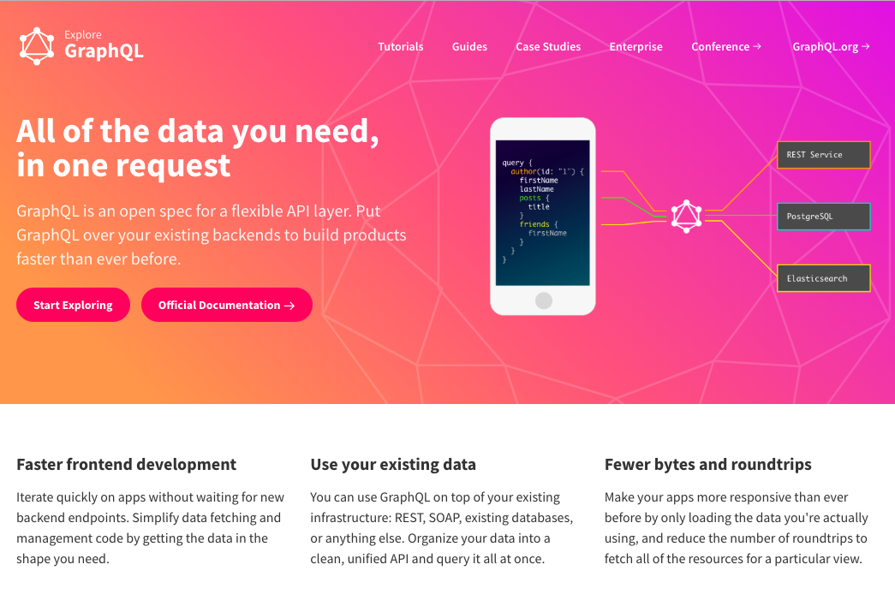
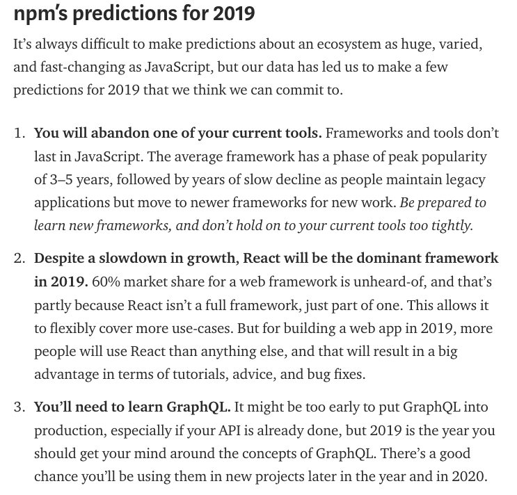
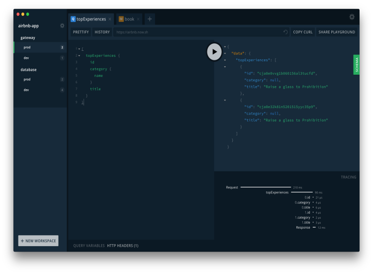
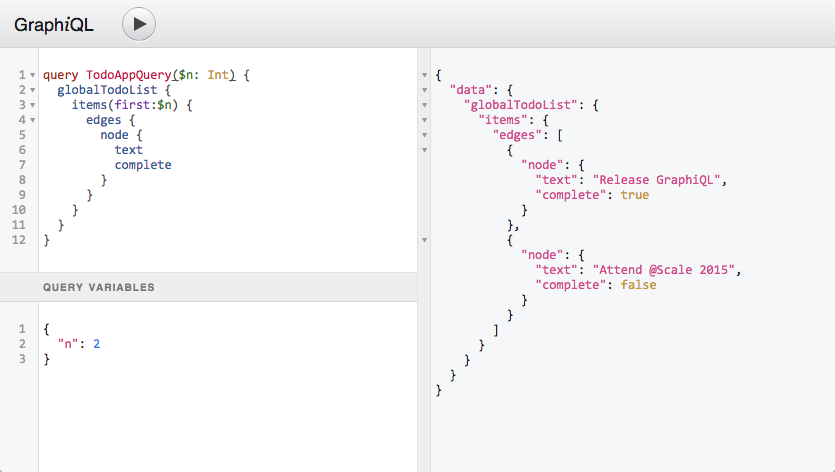

import { Head, Appear } from 'mdx-deck'
import { Invert, Split } from 'mdx-deck/layouts'
import Avatar from 'components/Avatar'

export { future as theme } from 'mdx-deck/themes'

<Head>
  <title>DGQL Jan 2019</title>
</Head>

# Welcome to [@DesertGraphQL](https://twitter.com/DesertGraphQL)

Thanks to [@DigitalAirStrk](https://twitter.com/DigitalAirStrk) for hosting us!

---
I'm [@BryanMierke](https://twitter.com/BryanMierke)

Staff Engineer @DigitalAirStrk

React | Redux | Node | 

Whole30 | Puppy Caretaker

<Avatar src='https://avatars3.githubusercontent.com/u/8486789?s=460&v=4' alt='bryan mierke github avatar' />

<Avatar src='images/cocoasleep.jpg' alt='cocoa' />
---
export default Invert

# Aweome things about GraphQL
<Appear>
  <p> 
    [Lets Learn GraphQL](https://letslearngraphql.com/) | I'm Free
  </p>
    <p> 
    [JSJOEIO Prezi](https://desert-gql-apollo-link-rest.netlify.com/#6)
  </p>
    <p> 
    [Prisma](https://www.prisma.io/) | Easily implement GraphQL Servers
  </p>
  <p> 
    [Graph.Cool](https://www.graph.cool/) | Open Source w/ 5 min get started video
  </p>
    <p> 
    [GraphQL Summit](https://summit.graphql.com/) | Put on by Apollo in the Winter
  </p>
    <p> 
    [How to GraphQL](https://www.howtographql.com/) | Full stack tutorial FREE!
  </p>
    <p> 
    [Snowtooth Highway](http://snowtooth.moonhighway.com/) | Free Playground API
  </p>
    <p> 
    [Advanced React & GraphQL](https://advancedreact.com/) | Wes Bos Course, Cost Monies
  </p>
  
  </Appear>

---

## [GraphQL.com](https://www.GraphQL.com)

 

```notes
- Create speaker notes in fenced code blocks
```
---

<a target='_blank' href='https://medium.com/npm-inc/this-year-in-javascript-2018-in-review-and-npms-predictions-for-2019-3a3d7e5298ef'></a>

---
## A Few finer Points
<Appear>
<p>
Specification
</p>
<p>
Origins
</p>
<p>
Overfetching vs Underfetching && in between
</p>
<p>
GraphQL Clients
</p>
<p>
Exploration Tools 
</p>
</Appear>
---
## There are Tools
export default Split






---
## Production Users
- IBM
- GitHub
- NYTimes
- Twitter
- Yelp
---
## The Pudding
<iframe src="https://codesandbox.io/embed/mq61mzo28p?view=preview" style={{ width: '87vw', height: '87vh', border: '0', borderRadius: '4px', overflow: 'hidden'}} sandbox="allow-modals allow-forms allow-popups allow-scripts allow-same-origin"></iframe>

---
Thank you

Credits
- [https://99-problems-graphql-aint-one.now.sh/](https://99-problems-graphql-aint-one.now.sh/)
- Presentation by [Sara Vieira](https://twitter.com/nikkitaftw?lang=en)
- Creator of [https://letslearngraphql.com](https://letslearngraphql.com)

